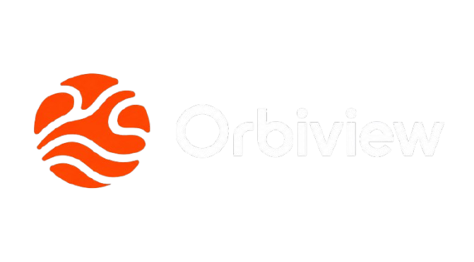
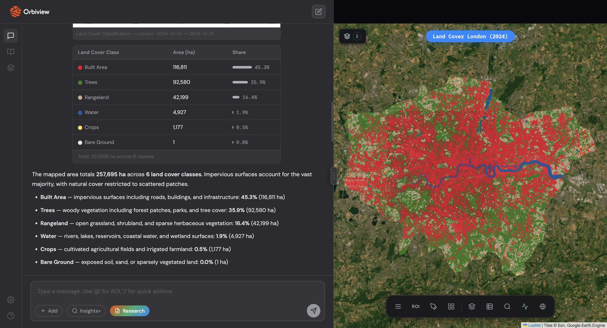
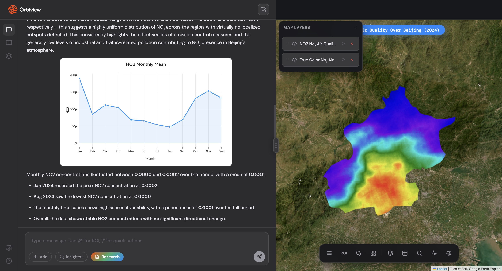
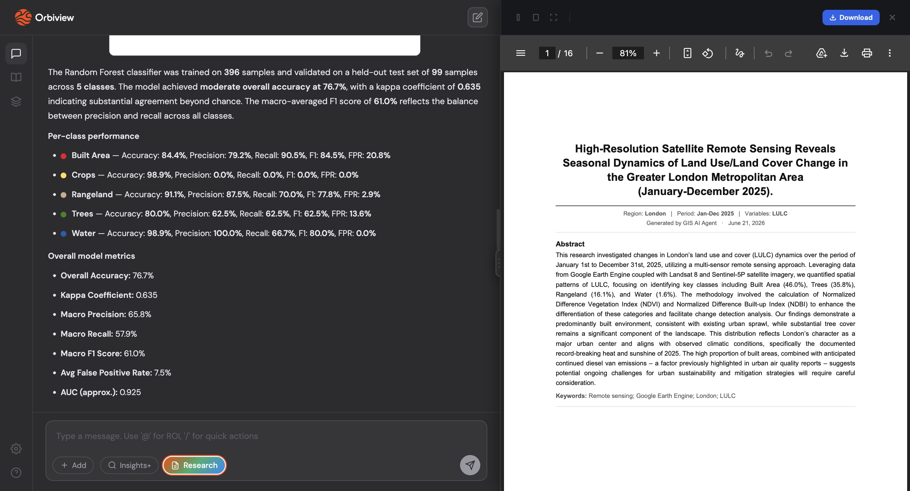
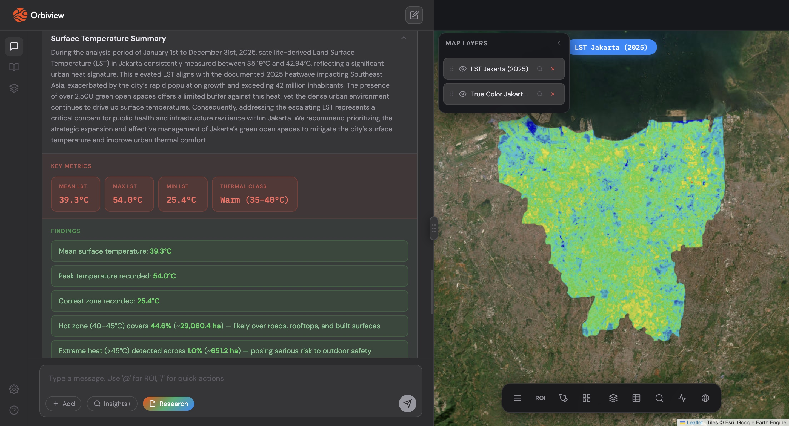

# Orbiview — GIS AI Agent

<div align="center">
  

  
  
  
  
  
  
  
  

</div>


## Demo
 
https://github.com/user-attachments/assets/18a93a1e-d11f-4439-b6fa-92052b746d48

## Overview

**Orbiview** is a geospatial AI agent that turns natural-language prompts into satellite imagery analysis. Ask about vegetation health, pollution levels, land cover change, or urban heat for any region and time range — Orbiview pulls the data from **Google Earth Engine**, runs the analysis, and returns interactive maps, charts, and narrative insights, powered by **Gemma** via **LangGraph**.

The interface is a split-panel web app: a chat panel for queries on one side, an interactive Leaflet map on the other — with support for custom ROI drawing, multi-year comparisons, and downloadable PDF research reports.

## Key Features

- 🗨️ **Chat interface** — ask questions in plain language; persistent chat history (localStorage)
- 🧠 **LangGraph agent** — structured multi-step reasoning with a live plan widget showing agent progress, powered by Gemma
- 🗺️ **Interactive map** — Leaflet.js + ESRI satellite basemap
- ✏️ **Draw your own ROI** — polygon or rectangle, name it, and reference it in chat with `@name`
- 📊 **19 GIS indices** — vegetation, water, urban, thermal, and atmospheric analysis (see table below)
- 🖼️ **Image overlays** — analysis results rendered as georeferenced JPG overlays on the map
- 📈 **Plotly visualizations** — monthly trend lines, LULC pie/bar charts, rendered inline in chat
- 📅 **Multi-year analysis** — per-year map tile layers plus combined comparison chart grids
- 🧾 **PDF research reports** — full report generation with formulas, figure descriptions, and ML metrics (accuracy, per-class metrics, confusion matrix for LULC)
- 🗂️ **Layer manager** — toggle visibility, zoom to, or remove any analysis layer
- 📚 **Knowledge Base** — in-app documentation page covering all 19 indices, with scroll-spy navigation and category accent colors

## Architecture

```
User Prompt
    │
    ▼
agent.py  ──────────► LangGraph orchestration (Gemma)
    │
    ├──► gis_functions.py ──► Google Earth Engine (index calculation, stats, classification)
    │
    ├──► research_agent.py ──► PDF report generation (ReportLab)
    │
    ▼
app.py (Flask) ──► JSON / map tiles / charts
    │
    ▼
templates/index.html + static/js/app.js ──► Chat + Leaflet map + Plotly charts
```

## Supported GIS Indices

| Category | Indices |
|---|---|
| 🌱 Vegetation | NDVI, EVI, SAVI |
| 💧 Water | NDWI, MNDWI |
| 🏙️ Built-up / Urban | NDBI, UI, BSI, NBI |
| 🌡️ Thermal | LST, UHI |
| ❄️ Snow | NDSI |
| 🌫️ Atmospheric / Air Quality | NO₂, CO, SO₂, CH₄, Aerosol, FFPI |
| 🗺️ Land Cover | LULC (with classification accuracy metrics) |

## Tech Stack

**Backend:** Flask · LangGraph · Gemma · Google Earth Engine Python API · ReportLab
**Frontend:** Vanilla JavaScript · Leaflet.js · Plotly.js · HTML5 · CSS3

## Folder Structure

```
gis-ai-agent/
├── agent.py                    # LangGraph agent orchestration
├── app.py                      # Flask backend & API routes
├── config.py                   # App configuration / environment settings
├── gis_functions.py            # GEE analysis logic for all 19 indices
├── research_agent.py           # PDF report generation (ReportLab)
├── requirements.txt            # Core agent dependencies
├── requirements_webapp.txt     # Web app (Flask) dependencies
├── assets/
│   └── orbiview.png            # App logo
├── static/
│   ├── css/
│   │   └── style.css
│   └── js/
│       └── app.js
├── templates/
│   └── index.html
├── gee-creds.json               # GEE credentials (gitignored)
├── gee-service-account.json     # GEE service account key (gitignored)
├── LICENSE
└── README.md
```

## Getting Started

### Prerequisites

- Python 3.9+
- A Google Earth Engine account with API access
- Access to a Gemma model endpoint (configured via `config.py`)

### Installation

```bash
git clone https://github.com/<your-username>/gis-ai-agent.git
cd gis-ai-agent

python -m venv venv
source venv/bin/activate     # On Windows: venv\Scripts\activate

pip install -r requirements.txt
pip install -r requirements_webapp.txt
```

Place your `gee-creds.json` and `gee-service-account.json` files in the project root (these are gitignored and never committed).

### Run

```bash
python app.py
```

Open: **http://localhost:5000**

## Requirements
```txt
earthengine-api>=0.1.370
geemap>=0.30.0
numpy>=1.24.0
matplotlib>=3.7.0
Pillow>=10.0.0
requests>=2.31.0
duckduckgo-search>=6.0.0
langgraph>=0.2.0
langchain-core>=0.2.0
langchain-ollama>=0.1.0
pydantic>=2.0.0
typing-extensions>=4.8.0
```
## Usage Examples

### Machine Learning
- User: "Show me the land cover of London in 2024"
- Orbiview: Understand the user's request, perform machine learning in GEE, and present the results with insights



### Trend Analysis
- User: "Analyze No2 air quality over Beijing in 2024"
- Orbiview: Creates visualization and identifies key patterns



### Research Agent
- User: "Analyze the 2025 land cover of London and generate a comprehensive research paper"
- Orbiview: Activate research mode, generate a research paper, and present the results



### Insights Summary
- User: "Analyze the land surface temperature of Jakarta in 2025"
- SmartLook: Generate an insights summary section with recommendations based on the analysis



## PDF Research Reports

Orbiview can generate a full downloadable PDF report for any analysis, including the formulas used, figure descriptions, and — for LULC classification — a complete accuracy breakdown (overall accuracy, per-class metrics, and confusion matrix).

## License

See the [LICENSE](LICENSE) file for details.

## Acknowledgments

- Google Earth Engine for satellite data infrastructure
- The LangChain / LangGraph team for the agent framework
- Google for the Gemma model
- Leaflet.js and Plotly.js for mapping and visualization

---

**Built for fast, conversational geospatial analysis** 